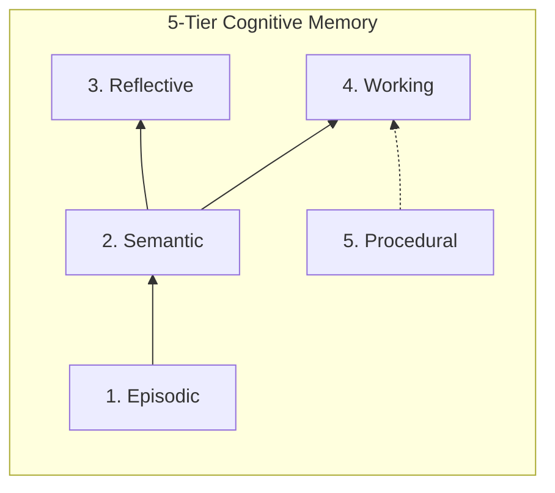
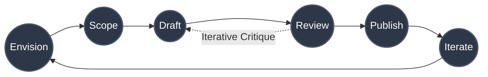

# 🚀 JP AI Future Study Group: An AI-Native Hub
**Proposal for 14th Monthly Talk (Sept 16, 2026)**  
**Presented by:** Dr. Sanjay Chitnis  

---

## 1. Background: The JP AI Study Group
* **Our Core Strength**: 176 members consisting of highly experienced domain leaders and critical thinkers.
* **Knowledge Foundation**: 
  * 13 well-researched monthly talks delivered by experts.
  * All sessions are recorded and minuted.
* **The "WhatsApp" Bottleneck**: 
  * Content and insights are shared via chat.
  * Members must read everything or skip it entirely to save time.
  * Difficult to retrieve past insights or synthesize them into formal documents.
* **Current Outcomes**: 
  * High individual awareness of AI trends globally and in India.
  * However, unlike other JP study groups, we have yet to produce formal, collaborative position papers.

---

## 2. Step 1: Building the Collective Memory (The Wiki)
* **The Concept**: Inspired by Andrej Karpathy's "LLM Wiki" (a personal second brain), extended into a shared group brain.
* **Why it is Needed**:
  * LLMs are memoryless: `Input + Context = Output`.
  * We cannot re-explain 13 months of context in every prompt.
  * The Wiki serves as the persistent "context" that AI agents read before acting.

### The 5-Tier Architecture
* **Episodic**: Seminar transcripts and meeting logs (e.g., `meeting-13.md`).
* **Semantic**: Verified facts, concepts, and source summaries from external literature.
* **Reflective**: Debates and perspectives (e.g., "Good vs. Bad AI").
* **Working**: Learning primers, incubation scratchpads, and NotebookLM packs.
* **Procedural**: The rules, playbooks, and agent skills that govern our work.

### How to Use the Wiki (via Obsidian)
* **Setup**: Download Obsidian (free) and open the `JP-AI-future-study` folder as a Vault.
* **Navigation**: Click on the `[[bracketed links]]` to instantly jump between concepts, sources, and projects.
* **Graph View**: Use Obsidian's graph view to visually see how different concepts (e.g., *Compute Sovereignty* and *Teacher Pedagogy*) intersect.

### How to Contribute & Collaborate
* **Adding New Material**: 
  * You don't have to format it manually. Simply drop a PDF/URL into the workspace and ask the AI agent to "ingest and source this."
  * The agent will save the raw file and create a standardized, linked summary in `wiki/semantic/sources/`.
* **Adding Perspectives**: 
  * Ask the agent to create a new perspective in `wiki/reflective/` (e.g., `ai-ethics-debate.md`).
* **Comments & Discussions**: 
  * To comment on a concept, open the markdown file and add a `## Member Comments` section at the bottom.
  * Tag your name (e.g., `> **[Sanjay]:** I think this misses the nuance of...`) so others can view and reply to your thoughts directly in the document.

---

## 3. Step 2: From Memory to Action (AI-Native Projects)
* **The Paradigm Shift**: Every member is now a "Boss of AI Agents." 
* **The Process**: We use a 6-stage loop of committed artifacts to turn Wiki knowledge into deliverables.
* **The 6 Stages**:
  1. **Envision (`intent.md`)**: Define the problem and audience.
  2. **Scope (`spec.md`)**: Agent synthesizes evidence from the Wiki and outlines the structure.
  3. **Draft (`draft.md`)**: Agent writes the content at machine speed.
  4. **Review (`review.md`)**: An automated "Red Team" agent critiques the draft for factual correctness, followed by human expert sign-off.
  5. **Publish (`final.md`)**: The finalized whitepaper or brief.
  6. **Iterate (`feedback.md`)**: Real-world reactions feed back into the next loop.

---

## 4. Future Steps: Creating Position Papers
* **The Goal**: Transition from passive learning to active policy influence and thought leadership.
* **Methodology**: We will use this AI-Native hub to launch multiple, concurrent whitepaper projects.
* **Live Examples**:
  * 📘 **Project 1: Research AI in India** 
    * A comprehensive study analyzing the ₹10,372 Cr IndiaAI Mission, compute sovereignty, and defense applications.
    * *Outputs*: Formal policy briefs and landscape matrices.
  * 📗 **Project 2: High School Teacher AI Pedagogy** 
    * A curriculum focused on transforming teachers into Socratic AI facilitators, preventing student cognitive deskilling.
    * *Outputs*: Vernacular training modules and literacy frameworks.
