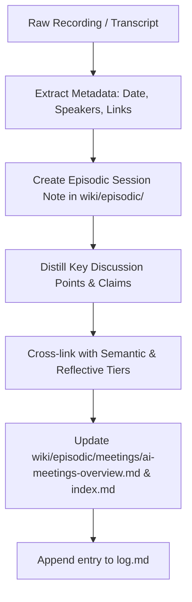

# Playbook: Ingesting Episodic Memories (Meetings, Seminars & Field Episodes)

This playbook guides human researchers and LLM agents on how to capture, process, and file timestamped, experiential, and event-based knowledge into the **Episodic Memory Tier** (`wiki/episodic/`).

---

## 1. When to File into Episodic Memory

File into `wiki/episodic/` whenever you have:
- **Study Group Sessions & Seminars**: E.g. Working group presentations, guest lectures, slide deck discussions.
- **Expert Interviews & Transcripts**: One-on-one or panel discussions with domain experts, economists, or policymakers.
- **Roundtables & Conferences**: Summits, track discussions, and Chatham House rule syntheses.
- **Chronological Milestones**: Major real-time events (e.g. IndiaAI compute tender awards, landmark regulatory announcements).

---

## 2. Ingestion Step-by-Step



### Step 1: Place Raw Artifacts (if any)
If you have a PDF schedule, raw transcript text, or audio file, ensure the immutable raw artifact is stored in `raw/` or linked directly to its cloud storage (e.g. Google Drive link).

### Step 2: Create the Episodic Note
1. Use `wiki/procedural/templates/template-episodic-event.md` or `wiki/episodic/meetings/session-template.md`.
2. Save under:
   - `wiki/episodic/meetings/<session-slug>.md` for regular study group sessions.
   - `wiki/episodic/interviews/<interviewee-slug>-<year>.md` for interviews.
   - `wiki/episodic/events/<event-slug>-<year>.md` for conferences/summits.

### Step 3: Populate Frontmatter
```yaml
---
memory_tier: episodic
type: meeting | interview | event
domains: [compute-infra, governance]
countries: [india]
tags: [study-group, seminar]
date: YYYY-MM-DD
speakers: ["Speaker Name"]
recording_url: "https://drive.google.com/..."
---
```

### Step 4: Triangulate into Other Memory Tiers
An episode should not remain isolated. Cross-link:
- Any new **conceptual claims** to `wiki/semantic/concepts/`.
- Any contested **debates** to `wiki/reflective/perspectives/`.
- Key **institutions or speakers** to `wiki/semantic/entities/`.
- Any primary documents referenced to `wiki/semantic/sources/`.

### Step 5: Update Indexes & Audit Trail
- Update the series index (e.g., `[[ai-meetings-overview]]`).
- Update Master `index.md` under Section 1 (Episodic Memory).
- Append an entry to `log.md`.
