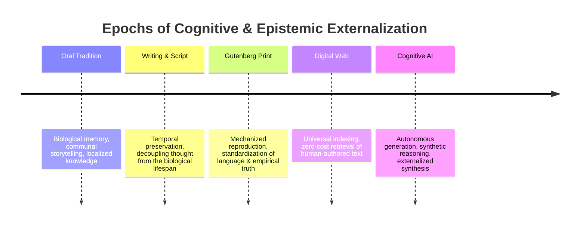

# AI Cognitive Revolution & Human Agency

## Conceptual Overview
The **AI Cognitive Revolution** describes the macro-historical transition wherein symbolic manipulation, analytical reasoning, and creative synthesis—faculties historically exclusive to biological human cognition—are externalized into algorithmic systems. Unlike prior technological revolutions that automated muscle power (Agricultural, Industrial) or automated information transmission and indexing (Print, Internet), the cognitive revolution directly mediates how humans form beliefs, construct knowledge, and exercise agency.

---

## The Historical Arc of Externalization

---

## Core Systemic Tensions

### 1. Cognitive Amplification vs. Cognitive Atrophy
- **The Epistemic Dilemma**: When an intellectual skill (e.g. analytical synthesis, software coding, drafting arguments) is delegated to an automated agent, human operators either experience exponential productivity leverage or progressive atrophy of underlying first-principles competence.
- **The "GPS Navigation" Analogy**: Pervasive automation of spatial routing degraded biological hippocampal navigation; similarly, unchecked reliance on LLM-synthesized conclusions risks degrading human critical evaluation (*Viveka*) and deep contemplative focus.

### 2. The Collapse of Empirical Verification Heuristics
- Historically, sensory evidence ("seeing is believing" / audio-visual records) served as the empirical bedrock for democratic deliberation and legal systems.
- With generative diffusion and voice synthesis, sensory capture ceases to be proof of reality. Societies face epistemic fragmentation unless cryptographic provenance and institutional validation mechanisms are established.

---

## Civilizational Implications for India

### 1. Re-engineering Education Beyond Rote Memorization
- India's traditional colonial-era educational infrastructure heavily rewarded rote memorization, standardized test recall, and templated problem solving.
- Because generative models perform commodity recall and templated syntax instantly, Indian education must rapidly pivot toward:
  - Socratic dialogue and debate.
  - Epistemological discrimination and verification of automated outputs.
  - Interdisciplinary systems thinking connecting technology with social impact.

### 2. Vernacular Knowledge & Civilizational Memory
- Rather than allowing global Western foundational models to unilaterally dictate cultural norms, values, and worldviews, India's cognitive strategy must ensure indigenous epistemologies, philosophical traditions, and multilingual literature are deeply embedded in sovereign AI models.

---

## Related Knowledge Nodes
- **Episodic Seminar**: [[meeting-11-ai-cognitive-revolution-unfolding|Session 11: AI, A Cognitive Revolution Unfolding? (Gaurav Marathe)]]
- **Foundational Concepts**:
  - [[human-agency-and-ai-alignment|Human Agency & Civilizational AI Alignment]]
  - [[bias-and-multilingual-fairness|Bias & Multilingual Fairness]]
  - [[indic-foundation-models|Indic Foundation Models & Datasets]]
- **Reflective Perspective**:
  - [[ai-impact-on-indian-it-jobs|IT Services & Knowledge Worker Transformation]]
