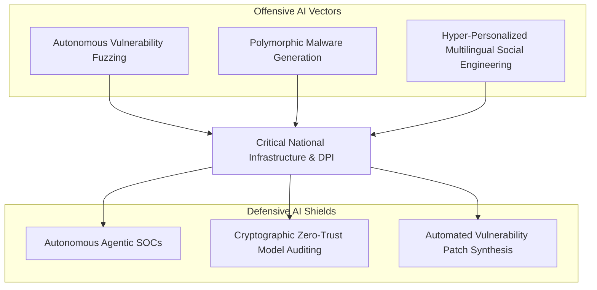

# AI Cybersecurity & Critical Infrastructure Defense

## Conceptual Overview
The convergence of Artificial Intelligence and Cybersecurity represents a paradigm shift from human-speed perimeter defense to machine-speed autonomous warfare. In the context of national infrastructure, AI operates as an asymmetric dual-use capability: dramatically reducing the resources required to discover, weaponize, and orchestrate cyberattacks, while simultaneously providing the automated telemetry and real-time response mechanics necessary to defend complex public networks.

---

## The Dual-Use Asymmetry

### 1. Offensive AI Capabilities
- **Automated Exploit Chaining**: Reinforcement learning agents capable of scanning vast codebases, discovering unpatched zero-days, and automatically constructing multi-stage exploit chains.
- **Polymorphic Payloads**: Models modifying code syntax and runtime behaviors on the fly, rendering signature-based detection and traditional EDR tools ineffective.
- **Deepfake & Social Engineering Vectors**: Zero-marginal-cost voice cloning and contextual linguistic mimicry in Indian vernacular languages targeting executive authentication.

### 2. Defensive AI Shields
- **Agentic Security Operations Centers (SOCs)**: Automated agents monitoring distributed telemetry across millions of endpoints, correlating micro-anomalies, and executing quarantine protocols in milliseconds.
- **Automated Program Repair (APR)**: Generative models fine-tuned on vulnerability databases to synthesize, test, and deploy verified patches prior to widespread exploit dissemination.

---

## Defending India's Digital Public Infrastructure (DPI)

India's interconnected public rails—processing over 14 billion monthly UPI transactions, authenticating 1.4 billion Aadhaar records, and routing healthcare and tax data—present a unique national security surface:

1. **Systemic Interconnection Vulnerability**: A breach in an auxiliary third-party application (e.g., a merchant payment app) risks traversing APIs into core banking switches if mutual TLS and zero-trust validation are bypassed.
2. **Data Integrity & Poisoning**: Subverting training datasets or API inputs for biometric or credit verification models can silently distort welfare distribution without triggering binary security alerts.
3. **Power Grid & SCADA Integration**: High-density AI data centers and renewable energy corridors rely on industrial IoT systems vulnerable to AI-orchestrated load-destabilization attacks.

---

## Policy & Institutional Architecture in India
- **CERT-In (Indian Computer Emergency Response Team)**: Real-time incident response guidelines and mandatory cyber-incident reporting.
- **NCIIPC (National Critical Information Infrastructure Protection Centre)**: Securing critical sectors (banking, power, defense, telecommunications).
- **Sovereign AI Red-Teaming**: Proposed institutional mandate requiring automated adversarial red-teaming for all foundation models deployed in Indian public governance.

---

## Related Knowledge Nodes
- **Episodic Seminar**: [[meeting-12-cyber-security-and-ai|Session 12: Cyber Security and Artificial Intelligence (Harsh Waghela & Advait Marathe)]]
- **Foundational Concepts**:
  - [[digital-public-infrastructure-for-ai|DPI for AI]]
  - [[compute-capacity-and-energy|Compute Capacity, GPUs & Energy Infrastructure]]
- **Key Entities**:
  - [[indiaai-mission|IndiaAI Mission]]
- **Dialectic Perspective**:
  - [[ai-regulatory-framework-india|India's AI Governance & Precautionary Regulation]]
