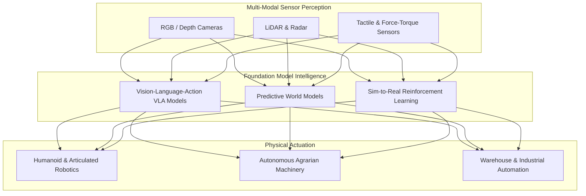

# Physical AI, Robotics & World Models

## Conceptual Overview
**Physical AI** (or **Embodied Artificial Intelligence**) denotes systems that perceive, reason about, and physically actuate within the continuous, three-dimensional physical world. Whereas digital AI operates in discrete token spaces (text, code, pixels), Physical AI must resolve real-time physical dynamics, material resistance, gravitational forces, and spatial geometry. It represents the crucial bridge connecting generative computational models to physical hardware, robotics, and industrial automation.

---

## The Core Technological Stack

### 1. Vision-Language-Action (VLA) Foundation Models
- Unifying semantic language understanding with direct motor control. Instead of outputting text tokens, VLA models output continuous joint angle velocities, gripper states, and 6-DOF spatial vectors directly from visual sensory inputs.

### 2. World Models & Generative Physics Engines
- Rather than relying solely on trial-and-error in physical reality, world models learn an internal simulation of real-world physics. They predict future environmental states conditioned on proposed actions, allowing robotic agents to simulate and verify plans mentally at thousands of frames per second.

### 3. Simulation-to-Real (Sim-to-Real) Transfer
- Training robotic policies across thousands of randomized physics simulations (varying friction, mass, lighting, sensor noise) and zero-shot transferring the robust policies onto real-world robotic hardware.

---

## Implications & Opportunities for India

### 1. Precision Agriculture & Harvesting
- India’s agricultural sector faces localized, seasonal labor shortages during harvesting windows. Physical AI enables localized weed eradication via micro-actuators, autonomous fruit harvesting, and automated drip-fertigation monitoring.

### 2. Electronics & Industrial Manufacturing
- As India expands its domestic manufacturing footprint under the Production Linked Incentive (PLI) schemes, flexible, vision-guided robotic arms lower the capital cost of assembling precision electronics and automotive sub-assemblies.

### 3. Hazardous Environment Automation
- Eliminating manual human intervention in lethal industrial tasks, including chemical reactor cleaning, deep underground mining inspection, and municipal sewer cleaning.

---

## Related Knowledge Nodes
- **Episodic Seminar**: [[meeting-10-physical-ai-next-frontier|Session 10: Physical AI: Next Frontier (Saurabh Bodas)]]
- **Foundational Concepts**:
  - [[compute-capacity-and-energy|Compute Capacity, GPUs & Energy Infrastructure]]
  - [[it-bpo-workforce-automation|IT & BPO Workforce Automation]]
- **Reflective Perspective**:
  - [[india-frontier-models-vs-applications|India's Frontier Model Debate]]
